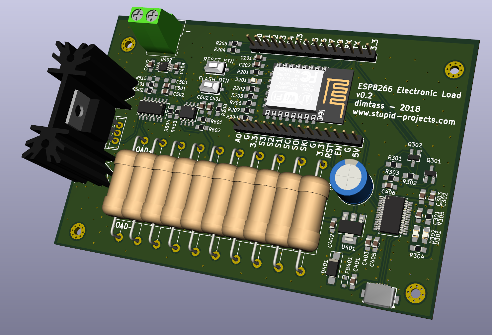

esp8266-web-eload
---
This project is how to build an electronic load with a web interface
by using the esp8266-E12 module and some other electronic components.
This version is using the Arduino ESP8266 for simplicity, but I would
like to make this soon also baremetal and use the ESP API instead.



## Board
You can also find the scematics to build a small pcb for that.
As you may already know, the esp8266 has a 10-bit ADC, but it lacks
a DAC. Therefore, we need an external SPI DAC. You can use any DAC
but as it is a home-project I prefer to use a bit more expensive
components.

The main components I've used are:
* `FDP6030BL`: N-Channel Logic Level MOSFET. This mosfet is features
40A, 30V, Rds(on)=0.024Ω @ Vgs=4.5V, 175oC max junction temp
* `MCP4821`: 12-bit SPI DAC with an internal Vref. This one has an
internal 2.048V reference and a 2x gain, therefore the Vref can be
up to 4.096V with a great accuracy. This means that we can drive the
Vgs on the MOSFET up to 4.096V, which means up to 4A with 1Ω load
resistor. If you need more current, then you can use the `MCP4921`
opamp which has an external reference, but that also means that you
need to provide a very clean and stable reference, too.
* `MCP6H04`: 4x single-supply, rail-to-rail opamp. This IC has four
opamps in the case. One is used to multiply the DAC output by a factor
of 2.2. One is used to drive the MOSFET and another one to buffer
the negative feedback loop to drive the ADC via a low pass RC filter
and a voltage divider with a 1/10 ratio.
* `FT232RL`: A USB to serial IC that is used for two reasons. One
is to power the circuit with 5V from the USB and the other is to
flash the esp8266. You need an IC that also has the DTR/RTS signals
in order to reset the board and put it into flash mode.

The DAC is 12-bit and it can take values 0-2.048V when the gain
is set to 1x or 0-4.096V when the gain is 2x. Also the ADC is 10-bits
with max input voltage 3V3, therefore it has 1024 steps. This means
that you need to use a voltage divider to feed the ADC.

## Build
You need to have the arduino IDE installed. I'm using Linux, so I'm
describing how to do that on Linux. First, download the IDE from
[here](https://www.arduino.cc/en/Main/Software). I usually prefer
specific versions because arduino IDE versions are known to be
incopatible with each other and some commands may not work between
versions. Therefore, for this project prefer to use version `1.8.6`
from [here](https://www.arduino.cc/download_handler.php?f=/arduino-1.8.6-linux64.tar.xz).
This is the x86_64 Linux version.

Extract the contents somewhere. I prefer `/opt`, for example
`/opt/arduino-1.8.6`.

Then open a console and run these commands:
```sh
mkdir -p ~/Arduino/hardware/esp8266com
cd ~/Arduino/hardware/esp8266com
git clone https://github.com/esp8266/Arduino.git esp8266
cd esp8266/tools
python get.py
/opt/arduino-1.8.6/arduino --install-boards esp8266:esp8266 --save-prefs
```

Then run the Arduino IDE and click `Tools -> Manage Libraries` and search
for the `websockets by Markus Sattler` library and select version `2.1.1`.
Then exit the Arduino IDE and from the source code folder run:
```sh
./build.sh
```

If your arduino IDE is not installed in `/opt/arduino-1.8.6` or you're
using a different version then you need to edit the `build.sh` script
and change the `ARDUINO=` variable with the correct path.

If everything goes right then you should have a folder named `build` and
inside that fodler a file named `esp8266-web-eload.ino.bin`.

Then connect you esp8266-E12 board with a USB cable on your computer and
verify which port is enumerated on it
```sh
dmesg | grep tty
```

Usually it will be the last port listed after you run the above command.

Finally, run the `upload-http-files.sh` script with the port you've found:
```sh
./upload-http-files.sh /dev/ttyUSB0
```

You might need to change the paths of the `mkspiffs` and `esptool` for the
script to work properly. If you want to be able to upload the web interface
from the Arduino IDE, then have a look to this plugin [here](https://github.com/esp8266/arduino-esp8266fs-plugin).
This will integrate this functionality in the IDE. I'm using the script
as it flashes everything on one go, but for development you don't have
to upload everything, so if you just change something in the code and the
web interface remains the same or the opposite, then better use the IDE.
